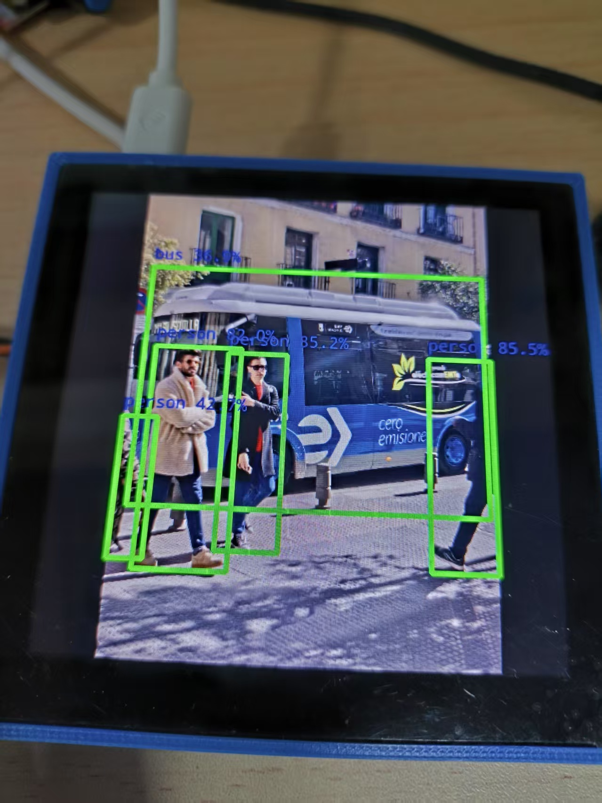

# Luckfox Pico RKMPI example

+ 本例程基于 RKNN 和 Opencv-Mobile 实现图像投影到屏幕
+ 本例程基于 使用480x480 lcd屏幕
+ 专

## 实现效果
### yolo_screen   



## 平台支持

+ **RV1106**：`Luckfox Pico Pro` `Luckfox Pico Max` `Luckfox Pico Ultra` `Luckfox Pico Ultra W` `sololink A`

## 编译
+ 不用设置环境变量

+ 获取仓库源码并设置自动编译脚本执行权限
    ```
    chmod a+x ./build.sh
    ./build.sh
    ```
+ 执行 `./build.sh` 后选择编译的例程,6为我的程序
    ```
    1) luckfox_pico_rtsp_opencv
    2) luckfox_pico_rtsp_opencv_capture
    3) luckfox_pico_rtsp_retinaface
    4) luckfox_pico_rtsp_retinaface_osd
    5) luckfox_pico_rtsp_yolov5
    6) luckfox_pico_screen_yolov5
    Enter your choice [1-6]:
    ```

## 运行
+ 编译完成后会在 install 文件夹下生成对应的部署文件夹
    ```
    luckfox_pico_rtsp_opencv_demo  
    luckfox_pico_rtsp_opencv_capture_demo  
    luckfox_pico_rtsp_retinaface_demo
    luckfox_pico_rtsp_retinaface_osd_demo
    luckfox_pico_rtsp_yolov5_demo 
    luckfox_pico_screen_yolov5
    ```
+ 将生成的部署文件夹完整上传到 Luckfox Pico 上 (可使用adb ssh等方式) ，板端进入文件夹运行
    ```
    # 在 Luckfox Pico 板端运行，<Demo Target> 是部署文件夹中的可执行程序
    chmod a+x ./luckfox_pico_screen_yolov5
    ./luckfox_pico_screen_yolov5 model/bus.jpg

    ```
+ 运行结果
    ```
    index=0, name=images, n_dims=4, dims=[1, 640, 640, 3], n_elems=1228800, size=1228800, fmt=NHWC, type=INT8, qnt_type=AFFINE, zp=-128, scale=0
    .003922
    index=0, name=output0, n_dims=4, dims=[1, 80, 80, 255], n_elems=1632000, size=1632000, fmt=NHWC, type=INT8, qnt_type=AFFINE, zp=-128, scale=
    0.003922
    index=1, name=286, n_dims=4, dims=[1, 40, 40, 255], n_elems=408000, size=408000, fmt=NHWC, type=INT8, qnt_type=AFFINE, zp=-128, scale=0.0039
    22
    index=2, name=288, n_dims=4, dims=[1, 20, 20, 255], n_elems=102000, size=102000, fmt=NHWC, type=INT8, qnt_type=AFFINE, zp=-128, scale=0.0039
    22
    model is NHWC input fmt
    model input height=640, width=640, channel=3
    load lable ./model/coco_80_labels_list.txt
    scale = 1.333333
    person @ (478 240 560 525) 0.855
    person @ (210 243 288 509) 0.852
    person @ (111 237 227 534) 0.820
    person @ (79 338 123 522) 0.427
    bus @ (97 116 553 455) 0.369
    cost 0.20 seconds

    ```

## 注意
+ 在运行demo前请执行 `RkLunch-stop.sh` 关闭 Luckofox Pico 开机默认开启的后台程序 `rkicp` ,解除对摄像头的占用。
+ RV1103 的系统资源较少，无法正常运行时请降低视频捕获的分辨率。
+ 由于 Rockit 库的更新，VPSS 组件无法继续单独取出数据帧，图像颜色格式的转换使用 Opencv-mobile 来替换。

## 详细
[RKMPI实例使用指南](https://wiki.luckfox.com/zh/Luckfox-Pico/Luckfox-Pico-RV1106/Luckfox-Pico-Ultra-W/RKMPI-example)